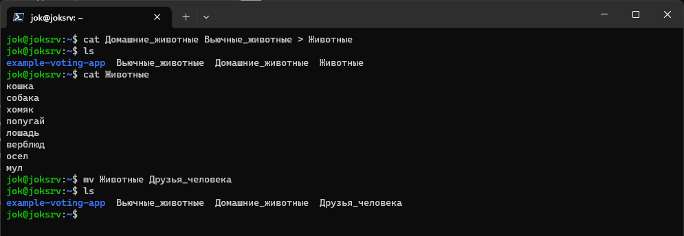

# Итоговая работа по блоку специализация

<a href="task/Итоговая%20аттестация.pdf" target="_blank">Файл задания</a>

# Ход выполнения

## Linux

### Задание 1 
Используя команду cat в терминале операционной системы Linux, создать два файла Домашние животные (заполнив файл собаками, кошками, хомяками) и Вьючные животными заполнив файл Лошадьми, верблюдами и ослы), а затем объединить их. Просмотреть содержимое созданного файла. Переименовать файл, дав ему новое имя (Друзья человека).

Создание файлов

Объединение, переименование файлов

### Задание 2

Создать директорию, переместить файл туда. 

### Задание 3 

Подключить дополнительный репозиторий MySQL. Установить любой пакет из этого репозитория.

### Задание 4

Установить и удалить deb-пакет с помощью dpkg. 

5. Выложить историю команд в терминале ubuntu

